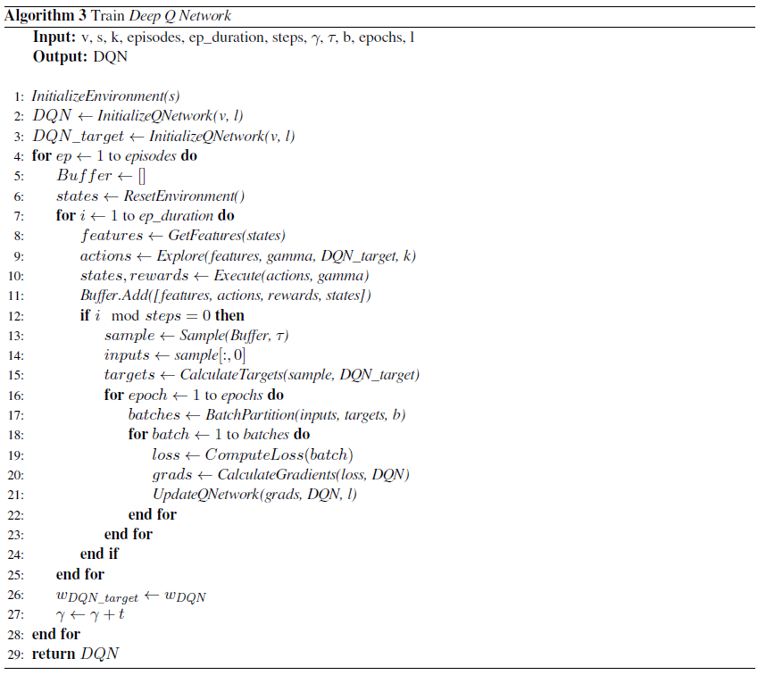
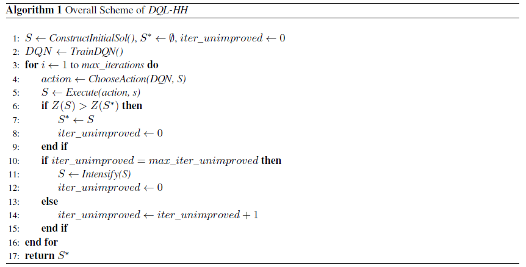
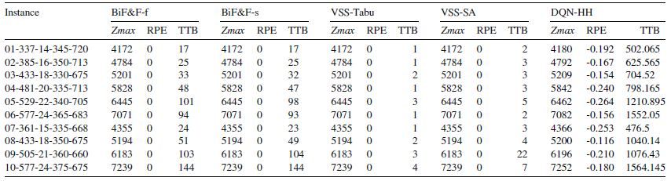

# Deep Q Learning algorithm for the Capacitated Team Orienteering Problem
### Overview

This project applies the Deep Q Learning methodology (greatly influenced by this [paper](https://www.cs.toronto.edu/%7Evmnih/docs/dqn.pdf)) in order to enhance the performance
of an algorithm used to solve the [CTOP](https://link.springer.com/article/10.1057/palgrave.jors.2602603). 

The said algorithm consists of the following main components:
* A construction heuristic used to generate a feasible solution to the problem
* A handful of solution improvement heuristics called **operators** which manage to either increment a given solution's profit or reduce its total cost. These include:
  1. Insertion of a node to the solution
  2. Deletion of a node from the solution
  3. Swap between an inner node (part of the current solution) and an outer
  4. Swap between two inner nodes
  5. Relocation of an inner node to another position in the solution
  6. [2opt](https://en.wikipedia.org/wiki/2-opt) move
  7. Execution of a [TSP heuristic](http://webhotel4.ruc.dk/~keld/research/LKH/) on every solution route
  8. Execution of a MIP model for simultenous insertions and deletions of customers from routes.
  
  ***Note***: The last two operators are not included in the learning mechanism due to their complexity as methods, as well as their significantly greater computational cost compared to the other ones.

The way DQL pursues to increase the quality of the algorithm is by tackling the
problem of optimallly selecting among the available operators at each iteration.
In other words, instead of implementing a meta-heuristic responsible for balancing the operators, we attempt to train a model that will recognize the adequate course of actions
on each solution state with a view of eventually achieving the biggest profit possible.

### DQL Methodology

DQL is a value function method, meaning that it tries to estimate the expected future reward of an action executed on a certain state. It uses a neural network as a value function approximator, which is trained via the following loss function:

$$L_i(θ_i)= (y_i - Q(s_i,a_i;θ_i))^2$$ where $$ y_i = r_i + γ*maxQ_{target}(s_{i+1};θ_t)$$

Three important notes here:
* The target $y$ depicts the expected rewards of a (state, action) pair as the sum of the immediate reward of the action and the highest expected
value after following the optimal policy at every next state, where the latter is discounted by a fator of $γ$.
* The next state q-values are not obtained from the trainable network; another model, the target network (with the same architecture as the original) is used to compute the max q-value for the target $y$. The only difference with the original is that this network has more stable weights, which are updated from the original, though at a slower pace using the formula:
$$θ_t = kθ + (1-k)θ_t$$
* $\gamma$ represents the discount factor applied to target netowrk's predicted q-values in order to reduce their influence on the exploration procedure as well as the target rewards. $\gamma$ is initially set at a small value between 0 and 1 and is constantly increased with a steady rate. The intuition behind this approach is that at first, the network is not capable of making good approximations of the expected rewards and hence we should not count on its  predictions. However, as it is gaining experience of the environment and learning more accurately we want to increase the level of confidence that we give to its approximations.

### Experience Replay

In order to improve the efficacy as well as the efficiency of the learning process, the idea of experience replay is implemented. According to it, the examples ran at each iteration are stored in a buffer, from where a sample is taken in order to calculate the gradients and update the weights. The replay buffer follows the **SARS** logic (state, action, rewards, next state). In a nutshell, the overall process has the following steps:
1. At the beginning of each episode, initialize the buffer and get the intitial states.
2. At every iteration generate a SARS sequence for every state implementing following **exploration strategy** and store the experiences in the buffer. Also update the target network weights by the aforementioned formula.
3. At the end of each episode, draw a random sample from the buffer and use it to train the model (***Note***: the buffer contains only the raw values of the examples, so q-values will be calculated again based on current networks' weights - which is the whole point anyway).

### Exploration Strategy
The exploration strategy is based on the idea of intrinsic rewards and aims at balancing between exploitation and exploration by reinforcing not only actions that render a high reward but also actions that lead to points of the environment that we haven't visited before. That being said, the exploration strategy for a given state $s$ is defined as follows:
$$a = \{ a_i \in A : R_{a_i} = \max\{[r(s, a_i) + r'(s, a_i)]\} \} $$

For all the available actions on each state, we select to execute the one with the highest sum of exploitation and exploration reward respectively. The **exploitation reward** is simply the normalized immediate reward that derives from executing the action. On the other hand, the **exploration reward** is calculated as the normalized euclidean distance between the next state, i.e. the state that will emerge if we choose to execute the action, and the nearest state that we have ever visited. This metric will give us an idea of how far the next state is from the directly closest state we have encountered so far and thus how "unexplored" the candidate state is.

However, the process of finding the closest state among the visited ones and calculating the distance from the said state is a computationally expensive task. For this reason, we develop an additional feature with a view of avoiding as much trivial calculations as possible. The method is based on *Localilty-Sensitive-Hashing* is inspired by the works of [Charikar (2002)](https://www.cs.princeton.edu/courses/archive/spr04/cos598B/bib/CharikarEstim.pdf) and [Tang et al. (2017)](https://arxiv.org/pdf/1611.04717.pdf). The intuition behind this method is that we attempt to apply a series of hash functions on a state in order to retrieve a *hash code*. States (feature-vectors) with similar values will receive the same hash code, whereas vectors with distant values will have different code. In this way we can narrow down the search for the closest vector only on the ones with the same hash code. The procedure for generating the hash code, according to Charikar (2002), is comprised of the following steps:
1.	Initialize k random vectors drawing values from the standard Gaussian distribution.
2.	Calculate the angular distance between the state vector and each of the k vectors as $$1 – \frac{\theta(s, r_i)}{\pi}$$, $\forall i \in$ \{$0, 1, ..., k$\}. This will result to a vector $v$ of size k.
3.	Turn the v vector into a binary vector $b$ by setting $b_i = 0$ if $v_i < 0.5$ else $b_i = 1$
4.	Generate the hash code by transforming the binary vector to a decimal number.

The value of k can have a double and counter-acting effect. Setting k to a large value can increase the number of calculations needed to derive the hash function, though at the same time it enhances the resolution of the codes, partitioning vectors to more sparse bins and therefore reducing the number of calculations needed to find the closest vector. After preliminary experiments, we saw that $k=50$ is a reasonable value that does not significantly slow down learning.

### Network Architecture

The network layers are as follows:
* **Input layer**:
  * Size: $(|V|, 10)$, where $V$ stands for the vehicles available (specified by instance data). For each vehicle we keep track of 10 features:
    * profit
    * profit per node
    * variance of profit per node
    * load
    * load per node
    * variance of load per node
    * cost
    * cost per node
    * variance of cost per node
    * nodes 
  * These features are scaled down using instance-specific constants that specify their limits, so that they obtain values at the [0, 1] scale (for instance, cost-related features are scaled down by the Tmax constraint which sets the max route cost).
* **1st hidden layer**:
  * Size: $(|V|, 10)$, a 10-neuron layer for each of the $V$ input vectors
  * ReLu activation 
* **Flattened layer**:
  * $10|V|$ neurons
* **Dropout layer**:
  * 20% dropout
* **2nd hidden layer**:
  * $\frac{10|V| + A}{2}$ neurons
  * ReLu activation
* **Output layer**:
  * $A$ neurons (as many as the actions)
  * Linear activation (rewards can be negative - when the action generates an infeasible solution, so we don't want to constrain the output)

<!-- Regarding the hidden layers, I'm considering the implementation of LeakyReLu activations instead of plain ReLu, since it will provide the flexibility of having negative outputs in those layers as well. The drawback with this idea is that it will possibly cause the outputs to deviate and thus slow down learning.

Another concern has to do with the scale difference between inputs and outputs. Inputs have a scale of $i * 10^2$, $i \epsilon (0,10)$, whereas outputs are in most cases around $i * 10^0$ (except for when the action is infeasible, in which case the reward is placed at -1000). I believe that lowering the scale of the inputs to match that of the outputs will accelerate learning, therefore I am about to implement one of the following alternatives:
1. Normalize state features before entering the network.
2. Implicilty lower their scale by applying batch normalization inside the network.
3. Initialize weights in such a way so that output values are in the required scale.

I am currently implementing the last idea, because I recon that the scale of the features has a meaning in the solution space and maybe I shouldn't distort it. I would appreciate your take on these ideas or others if I'm missing any. -->

### Network Update

As explained above, during each exploration step only one action is executed. This implies that, albeit the network has predicted the q-values for every state-action pair, the target value corresponds to a single pair at each step and therefore we are able to compute the loss only on the respective pair. However, we must also be consistent with the network architecture and assure that the target values have the same shape as the vectors of predicted values. Hence, we will transform the target value into a vector at the following way:

For an $A$ number of available actions the predicted q-values will be:

$$ y_{pred}=\begin{bmatrix} q_0 & q_1 & ... & q_{A-2} & q_{A-1} \end{bmatrix} $$

Let's consider $a$ to be the selected action on a certain step and $y$ the respective target reward. We construct the $A$-length vector of target values using the below function:

$$\begin{equation}
 q^{*}(i) =
  \begin{cases}
  e^{y} ,& i = a \\
  0 ,& otherwise
  \end{cases}
\end{equation}$$

This will result to a target vector as below:

$$ y_{target}=\begin{bmatrix} 0 & 0 & ... & e^{y} & ... & 0 & 0 \end{bmatrix} $$

Having formed the above vectors, we can compute the loss defined in \ref{loss} 
by applying a series of calculations:

$$\begin{equation}
L_i(\theta_i)= [\ln(y_{target} * e^{-y_{pred}})]^2
\end{equation}$$

This way, when we perform a matrix multiplication between $y_{target}$ and $e^{-y_{pred}}$, the resulting value will be $e^{y-q_a}$, since all other terms of the sum will be 0. From there, we apply the natural logarithm to remove the exponential and then by squaring the difference we are left with the calculation that we aimed for at the first place. The formulation delineated above facilitates the process of calculating the loss as well as the gradients of the network, since the whole procedure is being represented as a series of fuction applications and algebraic operations.

***Note:*** In practice, the above process would not work due to the precision error with float numbers. In particular, when the $y$ value was a large negative number, its exponential would result in a value that could not be expressed with the decimal places available, thus making $e^y = 0$. In order to resolve that problem, we scale down by a factor c the $y$ vectors before applying the exponential and then rescaling back with c after $ln$ has been applied.

<!-- As explained above, the target $y$ is calculated on a specific state-action pair. This means that for every example in the buffer, we can compare and calculate the loss only on one action's q-value. However, in order to be consistent with the network architecture, we transform $y$ into a vector at the following way:

Let's consider an example which refers to action 3 with $y=10$. Predicted q-values are:
$$ pred=\begin{bmatrix} 0 & 3 & 6 & 4 & 0 & 1 & 2 \end{bmatrix} $$

Target q_values will be:
$$ y=\begin{bmatrix} 0 & 3 & 6 & \color{Green} 10 & 0 & 1 & 2 \end{bmatrix} $$

This way, when we apply the loss $(y - pred)^2$, the network will effectively calculate the difference between "real" and predicted values that corresponds to the calculation proposed in theory and update its weights accordingly.
In practice we are working with mutiple examples on each update, where all the losses are averaged to produce the batch loss. -->

### Learning Scheme
To summarize, we present an outline of the learning mechanism:

The algorithm's hyper-parameters are:
* $v$: The number of vehicles forming a solution. This is an instance-specific parameter.
* $s$: The number of parallel solutions guided by the simulation.
* $k$: The number of hash functions applied to form the state's hash code.
* $episodes$: The number of simulation-training phases
* $ep duration$: The number of steps in the simulation
* $\gamma$: The reward discount factor
* $b$: The batch size for training
* $epochs$: The number of epochs for training
* $l$: The learning rate

### Overall Scheme

The complete implemented methodology is presented at the following pseudocode:

At first we train the network on the instance specified. Then, for each iteration we execute the following steps:
* We select the best action to perform by choosing the one with the highest reward predicted by the dqn.
* We execute the action to get the new solution and check if we have found a new best.
* If a new best solution has not been found for a certain number of consecutive iterations, call the intensification methods (TSP and MIP) to transfer the solution to a new neighborhood.

### Experimental Results

The table below summarizes our computational results against baselines on benchmark instances:

For every algorithm three columns are shown: the objective found by the best execution of the algorithm (Zmax), the
percentage gap between the current objective and the best among the algorithms of the previous papers (RPE) and finally
the execution time of the best repetition of the algorithm (TTB).

We notice that our approach does not manage to outperform any of the previous works and contributes the least to the best known solutions in literature.
However, it is worth mentioning that the instances for which it achieves improved results in comparison with the baselines have
something in common that distinguishes them from the rest: the number of vehicles is significantly larger with values
ranging from 14 to 24, whereas for all the remaining instances that number oscillates between 6 and 8. Therefore, we can
deduce that our methodology achieves deeper exploration of the solution space when the combinatorics of the problem
increase by the presence of a larger fleet of vehicles, which could motivate future research for harder and more complex instances.
